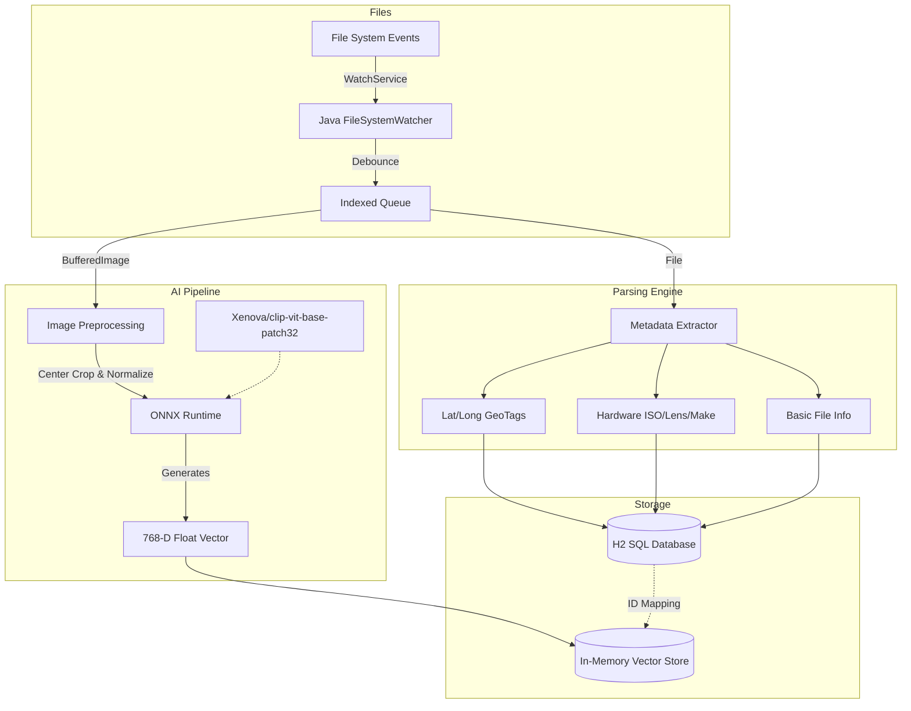

<h1 align="center">
  <br>
  📸 SmartGallery
  <br>
</h1>

<h4 align="center">A high-performance, AI-driven local gallery application with deeply integrated <b>Semantic Search</b>, <b>EXIF parsing</b>, and <b>Location Mapping</b>.</h4>

<p align="center">
  
  
  
  
  
</p>

<p align="center">
  <a href="#how-it-works">How It Works</a> •
  <a href="#key-features">Key Features</a> •
  <a href="#tech-stack">Tech Stack</a> •
  <a href="#installation">Installation</a>
</p>

---

## ⚙️ How It Works

SmartGallery completely fundamentally changes how local files are organized. Instead of relying on manual folder hierarchies, it uses an advanced multi-stage indexing pipeline powered by a local instance of the **OpenAI CLIP model** and an embedded **Vector Store**.

### System Architecture

When you add a local directory for SmartGallery to watch, the backend processing engine spins up. The following Mermaid map details exactly how a regular photograph gets transformed into a robust, searchable vector within the application.



### The Search Process
1. When a user types a query (e.g., *"me walking a dog"*), the exact same ONNX CLIP model generates a 768-dimensional mathematical vector representing the semantic meaning of that sentence.
2. The `SearchService` compares the sentence vector against every single image vector in the `InMemoryVectorStore` using **Cosine Similarity**.
3. Images with the highest mathematical similarity are instantly returned to the UI, bypassing traditional keyword matching entirely.

## ✨ Key Features

### 🧠 AI Semantic Search (CLIP)
*   **Natural Language Text-to-Image:** Search your library using descriptive sentences (e.g., *"a red car under a tree"* or *"a dog catching a frisbee"*).
*   **Image-to-Image Search:** Drag and drop an image into the browser to find visually similar photos across your entire library.
*   **Custom Threshold Slider:** Fine-tune the AI similarity "strictness" threshold directly from the UI.
*   **Absolute Privacy:** Neural embeddings are generated locally on your machine—no data is ever sent to the cloud.

### 📸 Pro-Level Metadata Extraction
*   **EXIF & IPTC Parsing:** Automatically extracts deep camera hardware details including **Make, Model, Lens, Focal Length, f-Stop, and ISO**.
*   **Dynamic Data Grid:** Camera data is parsed during background indexing and elegantly displayed in the interactive Detail Panel.

### 🗺️ Built-in GPS Mapping
*   **Geotag Extraction:** Parses embedded GPS lat/long metadata from your smartphone and drone photos.
*   **Leaflet Integration:** Renders a gorgeous interactive map explicitly pinning the exact geographic location where the photo was taken without leaving the detail panel.

### 🏷️ Custom "Overriding" Tags 
*   Because small AI models have inherent mathematical "blind spots" (e.g., struggling to identify specific niche objects), SmartGallery includes a manual tagging system.
*   Tagging a photo with `"cow"` automatically forces a mathematically perfect `100%` similarity score whenever you search for "cow", elegantly bypassing standard AI constraints.

### 🎨 Deep Aesthetic Focus
*   **Modern UI:** A stunning, desktop-first dark mode aesthetic heavily inspired by professional gallery tools.
*   **Fluid Lightbox:** Includes a completely custom zoomable lightbox with smooth drag-to-pan capabilities.
*   **Privacy Blur:** Instantly obscure sensitive photos with an elegant frosted-glass UI blur effect that easily toggles on and off.

## 🛠️ Tech Stack

### Backend
*   **Core:** Java 17+, Spring Boot (Web, Data JPA)
*   **AI Engine:** ONNX Runtime (`ai.onnxruntime`), DJL Tokenizers
*   **Metadata:** `com.drewnoakes:metadata-extractor`
*   **Database:** H2 In-Memory/File database combo (Spring Data JPA)

### Frontend
*   **Core:** HTML5, CSS3, Vanilla Javascript
*   **Libraries:** jQuery (Legacy AJAX bridging), Leaflet.js (Maps)
*   **Icons/Fonts:** Google Material Symbols, Inter Font Family

## 📥 Installation

### Prerequisites
1.  **Java Development Kit (JDK) 17** or higher.
2.  **Apache Maven** installed and configured in your PATH.
3.  A **HuggingFace Account** (for a one-time API token to download the AI models locally).

### Running the Application

1. **Clone the repository:**
   ```bash
   git clone https://github.com/kalaiselvan-arumugam/SmartGallery.git
   cd SmartGallery
   ```

2. **Compile and Run via Maven:**
   ```bash
   mvn clean install
   mvn spring-boot:run
   ```

3. **Open the Web UI:**
   Navigate to `http://localhost:8080` in your browser.

## ⚙️ Initial Configuration & Setup
When you first run the application, follow these steps in the Web UI:

1.  Click the **⚙️ Settings** icon in the bottom left corner.
2.  **Download Models:** Enter your *HuggingFace Read Token* in the AI Models tab, and click "Download Models". The system will download the `Xenova/clip-vit-base-patch32` weights to your local machine (`./models` directory). This is a one-time process.
3.  **Add Folders:** Navigate to the "Folders" tab and add local directories on your hard drive (e.g., `C:\Users\Name\Pictures`) for the application to watch.
4.  **Auto-Indexing:** The system will immediately parse EXIF data, compute AI vector embeddings, and save the data to the H2 database. 
5.  **Search!** You can now search your local files using natural sentences, custom tags, or file names.
